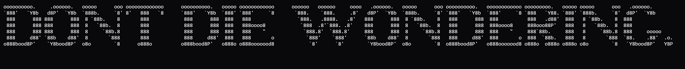

---

## Dark Mode PDF Export · Typst

A single-page (A4) dark-mode profile document with advanced data visualizations, built entirely with [**Typst**](https://typst.app) — no external packages required.

### What's inside `profile.typ`

| Section | Visualization |
|---|---|
| Header | ASCII-art banner + identity block + 5 quick-stat boxes |
| Contribution heatmap | 53 × 7 GitHub-style intensity grid (4 levels of green) |
| Skill bars | Proportional horizontal bars for 10 skills |
| Language distribution | Stacked proportional bar + dot legend |
| Commit trend | Monthly bar chart sparkline (12 months) |
| Pinned repos | 6 project cards with star / fork counts |
| Milestone timeline | Vertical dot-and-line timeline |

### Color palette (GitHub dark)

| Token | Hex | Usage |
|---|---|---|
| `bg` | `#0d1117` | Page background |
| `bg2` | `#161b22` | Cards / panels |
| `accent` | `#39d353` | Heatmap active / highlights |
| `cyan` | `#58a6ff` | Links / commit bars |
| `orange` | `#f0883e` | Rust / AWS |
| `purple` | `#bc8cff` | Python / language tags |
| `red` | `#ff7b72` | C++ / danger |
| `yellow` | `#e3b341` | TypeScript / caution |

### Build

```sh
# Install Typst (https://github.com/typst/typst/releases)
typst compile profile.typ profile.pdf

# Or via the Python binding (same Typst >= 0.11 requirement)
pip install typst
python - <<'EOF'
import typst
typst.Compiler("profile.typ").compile(output="profile.pdf")
EOF
```

> **Font note:** the document requests `Courier New`. On systems without it, Typst falls back to its built-in monospace font. Install a Courier New-compatible font (or swap the `font:` declaration) for the exact terminal aesthetic.
